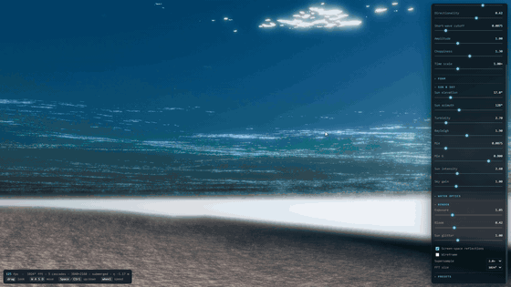

# ABYSSAL — spectral FFT ocean


A real-time, physically-based ocean in **one HTML file**. WebGL2 + three.js, no build step, no npm install — open it in a browser and you are sailing.

**[▶ Live demo](https://squall01337.github.io/abyssal-ocean/)**

---

## What it actually does

The water is not a scrolling normal map. It is an oceanographic wave spectrum, inverse-transformed on the GPU every frame:

- **JONSWAP spectrum** with the **TMA** shallow-water correction and **Donelan–Banner** directional spreading. Wind speed, fetch and sea depth are real inputs — the significant wave height matches the Hasselmann fetch-limited law to within ~2%.
- **3 spectral cascades** (768 m / 121 m / 19 m tiles) that partition k-space with no overlap, so you get swell out to the horizon *and* centimetre chop under the camera, with no visible tiling.
- **512² inverse FFT per cascade, per frame**, as a Cooley–Tukey butterfly with a precomputed twiddle/index texture. Two MRT slots carry four complex fields through the same butterfly pass, so one transform yields displacement, slope and the horizontal-displacement Jacobian at once.
- **Foam from physics, not from noise**: where the Jacobian of the Tessendorf displacement goes negative the surface folds — that is a breaking wave. Foam is injected there and then accumulated, diffused and decayed in a ping-pong buffer, so wakes persist and drift instead of popping.

## And the rest of the frame

- **Preetham analytic sky**, evaluated per pixel and shared by the sky dome, the water reflection and the ambient term on the island — turbidity and sun angle stay consistent everywhere.
- **Screen-space reflections** over a roughness-blurred sky fallback, **GGX** sun glitter widened by the solar disc.
- **Refraction with Beer–Lambert absorption** and in-scattering, plus **subsurface scattering** that lights up the back of the crests when the sun is low.
- **Caustics on the seabed** derived from the inverse Jacobian of the refracted-ray mapping through the actual FFT surface — they move with the waves because they *are* the waves.
- **Underwater is a real state**: a 1×1 GPU probe reads the wave height beneath the camera each frame, and going under gives you Snell's window, total internal reflection and volumetric fog.
- **Buoys with GPU buoyancy** — anchored, displaced and tilted by the wave field via an inverse-displacement solve.
- **Camera-centred exponential radial grid** (480 rings × 720 segments, 1.5 m → 24 km) so the mesh is crack-free all the way to the horizon.
- ACES tonemapping, 5-level bloom, up to 2× supersampling.

### Below the surface



## Controls

| | |
|---|---|
| `drag` | look |
| `W A S D` / `Z Q S D` / arrows | move |
| `Space` / `Ctrl` | up / down |
| `wheel` | movement speed |

On a phone the parameter panel stays on screen (bottom sheet in portrait, side column in landscape) and on-screen **look / move / heave** arrows drive the camera. The ocean view is left open above the menu — nothing is tucked behind a hamburger.

Everything on the panel is live: spectrum, foam, sun & sky, water optics, render. Four presets to start from — *Tropical calm*, *Golden hour*, *Open storm*, *Glass morning*.

## Running it

```bash
git clone https://github.com/squall01337/abyssal-ocean
cd abyssal-ocean
python -m http.server 8000   # any static server; needed for the ES module import
```

Then open `http://localhost:8000`.

FFT resolution can be forced with a query string: `?n=128`, `256`, `512` (default) or `1024`.

**Requires** a browser with WebGL2 and `EXT_color_buffer_float` (Chrome, Edge, Firefox, Safari 15+, including iOS Safari). It leans on the GPU — phones default to 256² FFT and 1.0× supersample; drop *Supersample* to 1.0× and the FFT to 256² on a laptop if needed.

## Why is it one file?

Because it can be. The whole thing is ~1600 lines: the GLSL lives in template literals next to the JavaScript that drives it, three.js comes from a CDN through an import map, and there is nothing to bundle, transpile or install. You can read the ocean from spectrum to pixel in a single scroll, drop the file in any folder, and it runs.

If you want to lift a piece into your own project, the file is cut into labelled sections (`CONFIGURATION`, `SHARED GLSL`, `PASS 1…6`, `OCEAN`, `POST PROCESSING`) — the FFT chain in particular is self-contained and only needs the butterfly texture and six fullscreen passes.

## References

- Tessendorf, *Simulating Ocean Water* (2001)
- Hasselmann et al., JONSWAP (1973) · Bouws et al., TMA (1985)
- Donelan, Hamilton & Hui, directional spreading (1985)
- Preetham, Shirley & Smits, *A Practical Analytic Model for Daylight* (1999)

## License

MIT — see [LICENSE](LICENSE).
